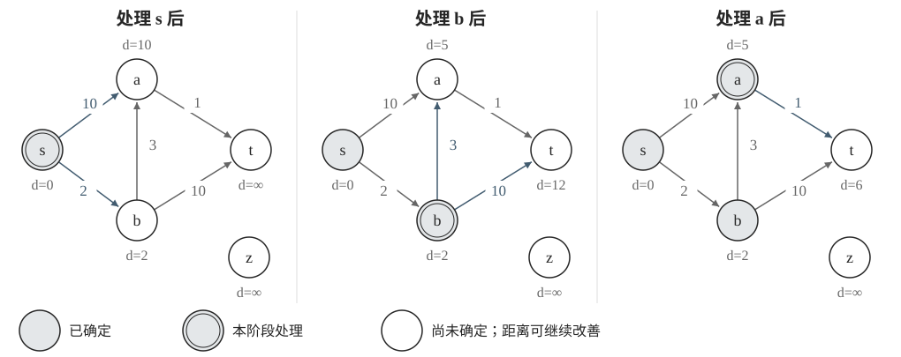
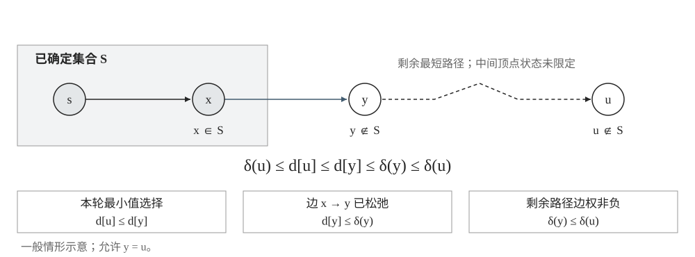
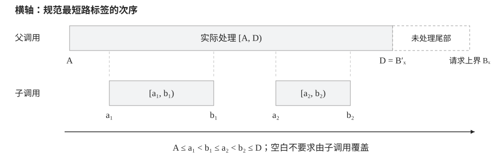
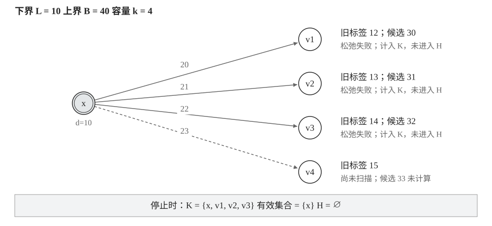
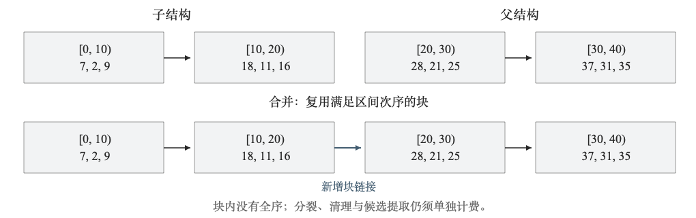
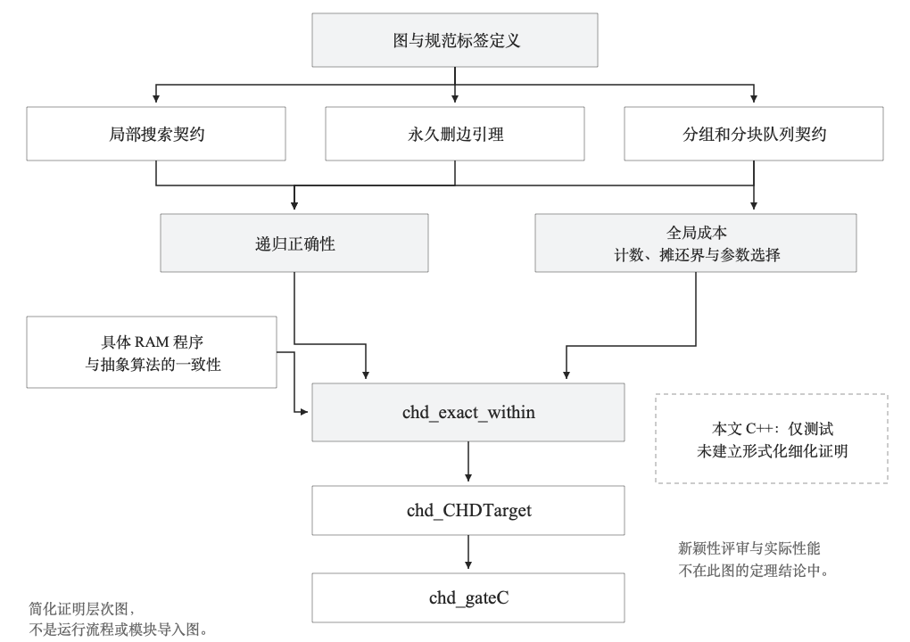
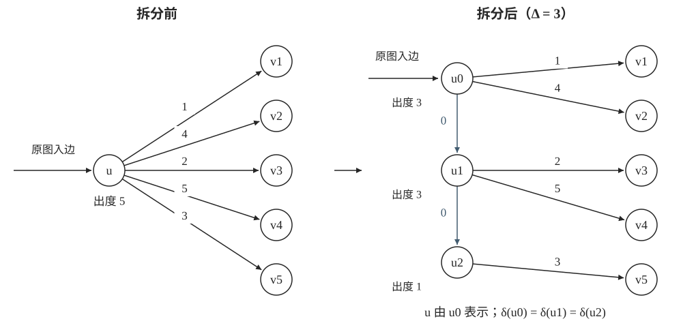
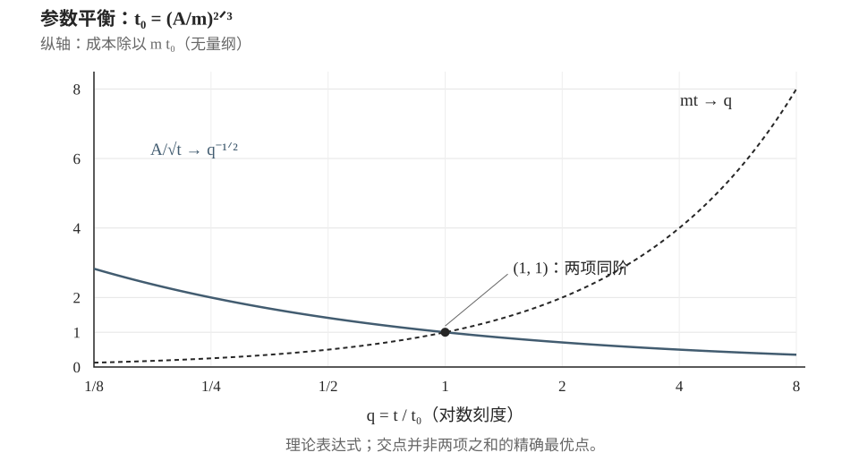

Dijkstra vs C-HD：单源最短路径的算法、证明与实现
=======================================================================

:date: 2026-09-30
:slug: dijkstra-vs-chd
:tags: algorithm, graph, cpp, lean, zh
:lang: zh
:draft: false

Dijkstra 算法由 Edsger W. Dijkstra 提出，发表于 1959 年的论文 *A note on two problems in connexion with graphs*，刊载于 *Numerische Mathematik* 第 1 卷，269–271 页。本文讨论其中的最短路径方法：反复选择当前距离估计最小的顶点，以非负边权保证这一选择的正确性。后文作为比较基准的 :math:`O(m+n\log n)` 上界依赖 Fibonacci 堆，并非 1959 年论文中原有的实现。

2026 年 9 月 20 日，Geby Jaff 在 Vals AI 发表实验报告 *A Faster Shortest Path Algorithm*。据报告记载，十个 Claude Opus 5.5 智能体通过共享留言板协作，在约十五小时、733 条消息的交互中提出了 C-HD，并完成了相应的 Lean 形式化工作。任务不仅要求给出算法，还要求证明正确性和时间上界、比较已有结果，并记录失败尝试。

这项工作的研究背景并不是“Dijkstra 的时间界从未被改进”。Ran Duan、Jiayi Mao、Xiao Mao、Xinkai Shu 和 Longhui Yin 在 2025 年的 *Breaking the Sorting Barrier for Directed Single-Source Shortest Paths* 中，已经给出了比较—加法模型下的确定性 :math:`O(m\log^{2/3} n)` 算法。2026 年，Ran Duan、Xiao Mao、Xinkai Shu 和 Longhui Yin 又在 *A Faster Directed Single-Source Shortest Path Algorithm* 中进一步改进了上界。这些结果适用的密度范围并不完全相同；C-HD 所针对的，是其中仍以 Dijkstra 为重要基准的一段密度范围。

下面从 Dijkstra 的贪心证明出发，看看 C-HD 如何把全局选最小值的工作拆成局部搜索、分组和递归，再通过成本平衡得到更小的时间上界。数学部分使用非负实数边权，代码使用非负整数。C++ 部分展示 Dijkstra 和 C-HD 的单次局部搜索。

1. Dijkstra 算法
-----------------------------------------------------------------------

单源最短路径与计算模型
~~~~~~~~~~~~~~~~~~~~~~~~~~~~~~~~~~~~~~~~~~~~~~~~~~~~~~~~~~~~~~~~~~~~~~~

给定有限有向图 :math:`G=(V,E)`、源点 :math:`s` 和非负边权 :math:`w`，记 :math:`n=|V|`、:math:`m=|E|`。单源最短路径问题要求计算每个顶点的最短距离：

.. math::

   \delta(v)=\operatorname{dist}_G(s,v)
   =\min_{p:s\leadsto v}\sum_{e\in p}w(e).

不可达顶点的距离为 :math:`\infty`。可以允许平行边、自环和零权边；这里不要求返回所有路径，也不要求将结果按距离排序。非负权条件保证可以从最短游走中去除环，因此可达顶点存在取得最小长度的简单路径。

复杂度比较采用权重的比较—加法模型：实数权重只进行比较与相加，每次计为常数成本；不利用边权的位表示作整数排序。顶点编号、计数器与指针由形式化 RAM 的字操作处理。这个模型不同于带浮点舍入误差的实际计算。

距离估计与松弛
~~~~~~~~~~~~~~~~~~~~~~~~~~~~~~~~~~~~~~~~~~~~~~~~~~~~~~~~~~~~~~~~~~~~~~~

算法维护的 :math:`d[v]` 与数学定义的 :math:`\delta(v)` 需要区分。前者是当前找到的距离估计，后者是真正的最短距离。初始时 :math:`d[s]=0`，其余估计为无穷。

每当得到一条经由 :math:`u` 到达 :math:`v` 的路径，就进行松弛：

.. math::

   d[v]\leftarrow\min\{d[v],d[u]+w(u,v)\}.

松弛只负责改善估计。Dijkstra 额外规定：每次选择估计最小的未确定顶点，确定其距离，再松弛它的出边。

处理源点后，:math:`a` 的估计为 ``10``，:math:`b` 为 ``2``。先处理 :math:`b`，便能将 :math:`a` 改善为 ``2+3=5``，同时得到 :math:`t` 的估计 ``12``。接着处理 :math:`a`，将 :math:`t` 改善为 ``5+1=6``。

**示例图的距离更新**

+--------------+----------+----------+----------+----------+
| 已完成的步骤       | ``d[s]`` | ``d[a]`` | ``d[b]`` | ``d[t]`` |
+--------------+----------+----------+----------+----------+
| 初始化          | 0        | ∞        | ∞        | ∞        |
+--------------+----------+----------+----------+----------+
| 处理 :math:`s` 的出边 | 0        | 10       | 2        | ∞        |
+--------------+----------+----------+----------+----------+
| 处理 :math:`b` 的出边 | 0        | 5        | 2        | 12       |
+--------------+----------+----------+----------+----------+
| 处理 :math:`a` 的出边 | 0        | 5        | 2        | 6        |
+--------------+----------+----------+----------+----------+

贪心选择的正确性证明
~~~~~~~~~~~~~~~~~~~~~~~~~~~~~~~~~~~~~~~~~~~~~~~~~~~~~~~~~~~~~~~~~~~~~~~

记已确定顶点的集合为 :math:`S`。证明的归纳假设是：其中每个顶点的估计都已经正确。

另外，算法产生的每个有限估计都是某条实际路径的长度，所以始终有：

.. math::

   \delta(v)\le d[v].

设本轮选择 :math:`u`，且 :math:`d[u]` 有限。在一条从 :math:`s` 到 :math:`u` 的最短路径上，取第一个不属于 :math:`S` 的顶点 :math:`y`；除初始源点这一基本情形外，它的前驱 :math:`x` 属于 :math:`S`。

:math:`x` 的距离已经正确，而且它的出边处理过，因此：

.. math::

   d[y]\le d[x]+w(x,y)
          =\delta(x)+w(x,y)
          =\delta(y).

最后一个等号使用了最短路径的前缀也是最短路径这一性质。由于 :math:`u` 是当前估计最小的未确定顶点，而 :math:`y` 尚未确定，所以 :math:`d[u]\leq d[y]`。又因为从 :math:`y` 到 :math:`u` 的剩余边权非负，:math:`\delta(y)\leq\delta(u)`。合并得到：

.. math::

   \delta(u)\le d[u]\le d[y]\le\delta(y)\le\delta(u).

首尾相等，故 :math:`d[u]=\delta(u)`。这就完成了归纳步骤。

非负边权在这里有明确用途：保证路径前缀不比整条路径更长。若允许负权边，该不等式不一定成立。例如边权分别为 ``s→a:2``、``s→b:5``、``b→a:-10`` 时，先确定 ``a=2`` 就会出错，真实最短距离是 ``-5``。

若候选队列为空而某个顶点仍保持无穷，它就不可达。否则沿一条到达它的路径，仍能找到第一条从已处理部分进入未处理部分的边，这条边本应产生一个有限候选，与队列为空矛盾。

贪心步骤的 Lean 形式化证明
~~~~~~~~~~~~~~~~~~~~~~~~~~~~~~~~~~~~~~~~~~~~~~~~~~~~~~~~~~~~~~~~~~~~~~~

Lean 检查的是形式化命题及其证明，不是通过大量输入推测算法正确。证明者先给出图、路径、状态转移等定义，再构造从这些定义推出结论的证明项；内核检查证明项是否具有所声明的命题类型。

先将上述证明最后的一段不等式写成 Lean。``ℝ≥0∞`` 表示含无穷的非负扩展实数，适合表示最短距离。下面的引理只封装“本轮选择的顶点正确”这一步：

.. code-block:: lean

   import Mathlib.Data.ENNReal.Basic

   namespace ShortestPathNotes

   theorem settle_from_boundary
       {V : Type*}
       (settled : Set V) (d delta : V → ℝ≥0∞) (u : V)
       (upper : ∀ v, delta v ≤ d v)
       (minimum : ∀ v, v ∉ settled → d u ≤ d v)
       (crossing : ∃ y, y ∉ settled ∧ d y ≤ delta y ∧ delta y ≤ delta u) :
       d u = delta u := by
     rcases crossing with ⟨y, hy, hy_exact, hy_prefix⟩
     apply le_antisymm
     · exact le_trans (minimum y hy) (le_trans hy_exact hy_prefix)
     · exact upper u

   end ShortestPathNotes

``upper`` 对应 :math:`\delta(v)\leq d[v]`；``minimum`` 表示 :math:`u` 的估计最小；``crossing`` 提供最短路径上的边界顶点 :math:`y`，以及刚才推导出的两个不等式。

证明中，``rcases`` 取出这个顶点及其条件，``le_antisymm`` 将等式拆成两个方向的不等式，``le_trans`` 则连接不等式。这里没有枚举图或顶点数，结论对满足这些假设的任意对象成立。

这里最关键的图论工作在 ``crossing``：从最短路径上找到边界顶点，再利用循环不变量建立两个不等式。把这一步接到程序上，还需要证明初始化、松弛和每次取最小值都维持这些不变量。

检查 Lean 证明还需要查看实际定理及其依赖的公理，而不仅是确认文件能够编译：

.. code-block:: lean

   #print axioms ShortestPathNotes.settle_from_boundary

``sorry`` 是未完成证明的占位方式，其依赖会显示为 ``sorryAx``。自定义公理也可能直接假定了本应证明的结论。Lean 官方建议审查依赖公理，并在需要时重新通过内核检查保存的证明。

优先队列与时间复杂度
~~~~~~~~~~~~~~~~~~~~~~~~~~~~~~~~~~~~~~~~~~~~~~~~~~~~~~~~~~~~~~~~~~~~~~~

每个顶点确定一次，每条出边扫描一次。剩下的成本取决于怎样维护候选顶点。

若使用支持按顶点更新键值的二叉堆，最多 :math:`n` 次取最小值、:math:`m` 次更新，得到 :math:`O((n+m)\log n)`。Fibonacci 堆可将插入和减小键值的摊还成本降为常数，从而得到经典上界：

.. math::

   O(m+n\log n).

这里的摊还分析约束整个操作序列，不是说每次取最小值都严格花费对数时间。后文比较 C-HD 时采用这一理论基准，而不是把普通二叉堆版本当作 Dijkstra 的最佳已知实现。

堆也没有始终保存一份完全排好序的数组。更准确地说，Dijkstra 通过反复取最小值，按非递减的真实距离确定可达顶点。最短距离向量本身却不要求以这种顺序输出。因此，不能把排序下界直接当作单源最短路径问题的下界。

Dijkstra 的 C++ 实现
~~~~~~~~~~~~~~~~~~~~~~~~~~~~~~~~~~~~~~~~~~~~~~~~~~~~~~~~~~~~~~~~~~~~~~~

以下使用标准库小根堆。标准库没有直接提供这里所需的按顶点减小键值操作，因此每次改善距离时插入新记录，旧记录在弹出时丢弃。

本实现的输入为非负整数边权。``INF`` 保留作不可达标记；若某次候选距离的加法超出可表示范围，直接报错，避免溢出或将有限距离与无穷混淆。这一策略要求每次实际计算的候选都可表示，即使该候选最终不会成为最短距离。

.. code-block:: cpp

   #include <cstdint>
   #include <functional>
   #include <limits>
   #include <queue>
   #include <stdexcept>
   #include <utility>
   #include <vector>

   using Distance = std::int64_t;
   using Vertex = std::size_t;
   constexpr Distance INF = std::numeric_limits<Distance>::max();

   struct Edge {
       Vertex to;
       Distance weight;
   };
   using Graph = std::vector<std::vector<Edge>>;

   std::vector<Distance> dijkstra(const Graph& graph, Vertex source) {
       if (source >= graph.size()) throw std::out_of_range("invalid source");
       for (const auto& row : graph) {
           for (const auto& e : row) {
               if (e.to >= graph.size()) throw std::out_of_range("invalid vertex");
               if (e.weight < 0 || e.weight == INF) {
                   throw std::invalid_argument("invalid weight");
               }
           }
       }

       std::vector<Distance> dist(graph.size(), INF);
       using State = std::pair<Distance, Vertex>;  // 距离快照、顶点编号
       std::priority_queue<State, std::vector<State>, std::greater<State>> queue;

       dist[source] = 0;
       queue.emplace(0, source);

       while (!queue.empty()) {
           const auto [du, u] = queue.top();
           queue.pop();
           if (du != dist[u]) continue;  // 丢弃已被更短距离替代的记录

           for (const auto& e : graph[u]) {
               if (e.weight >= INF - du) {
                   throw std::overflow_error("distance cannot be represented");
               }
               const Distance candidate = du + e.weight;
               if (candidate < dist[e.to]) {
                   dist[e.to] = candidate;
                   queue.emplace(candidate, e.to);
               }
           }
       }
       return dist;
   }

``du`` 是入堆时保存的距离快照，``dist[u]`` 是当前估计。在前述 Dijkstra 示例中，堆会先后保存 ``(10,a)`` 和 ``(5,a)``。后者先被处理；旧记录 ``(10,a)`` 弹出时，``du != dist[u]``，因此跳过。该判断只跳过当前循环，不会结束算法。

若仅求从 :math:`s` 到 ``target`` 的最短距离，可以在过期记录检查之后加入：

.. code-block:: cpp

   if (u == target) break;

随后取返回向量中的 ``dist[target]``；其他未确定顶点的估计不一定是最终答案。
不能在首次将目标放进堆时结束，因为此时它还只是一个候选。

这份实现允许同一顶点在堆中出现多次。对一般有向多重图，记录数为 :math:`O(m+1)`，时间可写为 :math:`O(n+m\log(m+2))`，含图的空间为 :math:`O(n+m)`。简单图中 :math:`m\leq n^2`，对数项可换成 :math:`O(\log n)`。这里使用的是二叉堆，时间界与 Fibonacci 堆版本不同。

配套测试将结果与独立的 Bellman–Ford 实现比较，并覆盖零权环、平行边、自环、不可达顶点、过期队列记录和整数边界。

2. C-HD 算法
-----------------------------------------------------------------------

C-HD 保留松弛操作，但不再依赖一个覆盖全部候选顶点的优先队列来组织整个算法。它沿用有界多源最短路径的递归框架，通过局部搜索形成分组，再批量选择候选进入下一层。它仍然做优先比较，递归基本情形也仍使用有界 Dijkstra。

这里的“分组”不是把图任意切成互不相连的几块。不同组之间可能有边，局部搜索的入口也未必全都具有已经确定的标签。递归必须维持距离边界和入口覆盖条件，才能保证分组后没有漏掉更短路径。

有界递归的输入与返回条件
~~~~~~~~~~~~~~~~~~~~~~~~~~~~~~~~~~~~~~~~~~~~~~~~~~~~~~~~~~~~~~~~~~~~~~~

用 :math:`X` 表示一次递归调用。它接收入口集合 :math:`S_X`、上界 :math:`B_X` 和层数，处理由这些入口覆盖、位于上界之前的目标。

调用返回一批已经确定距离的顶点 :math:`U_X`，以及实际处理到的边界 :math:`B'_X\leq B_X`。如果达到规模限制，可以只完成前面一段，而不是必须处理完所有小于原上界的顶点。父调用继续处理剩余部分。

后文的计数依赖这一结构：父子处理的区间嵌套，同层调用实际处理的区间互不重叠。这里的区间依据规范最短路标签定义，不是任意划出的顶点编号区间。

``FindPivots-HD`` 是为递归准备分组的过程。它从 :math:`S_X` 中的入口依次做局部搜索，形成搜索树，将树划分为规模受控的片段，再把入口顶点归入相应组。每组选择代表参与后续处理。新遇到的叶子不一定能成为代表，搜索树也不等于最短路径树。

局部搜索与未扩展叶子计数
~~~~~~~~~~~~~~~~~~~~~~~~~~~~~~~~~~~~~~~~~~~~~~~~~~~~~~~~~~~~~~~~~~~~~~~

一次局部搜索维护两个集合：:math:`K` 保存本次遇到的顶点，:math:`H` 保存还需要扩展的候选。起点同时进入二者，所以 :math:`|K|` 初始为一。

每次从 :math:`H` 中取出当前标签最小的顶点，扫描上界之前的出边。首次遇到一个此前未计入 :math:`K` 的目标时，即使松弛失败，也将其计入 :math:`K`。成功松弛的目标进入 :math:`H`；失败的目标暂时只作为未扩展叶子。以后若通过另一条边成功松弛该叶子，它仍可以进入 :math:`H`。

搜索在三种情况下停止：:math:`|K|` 达到上限 :math:`k`；候选全部耗尽；或接触到本次分组过程中已经形成的搜索树。接触时，当前搜索得到的树通过接触边交给外层合并，不继续重复扩展已有树。

这条规则控制的是实际搜索成本，而不是成功更新的数量。如果只计算成功更新，就可能在进度没有增加的情况下扫描大量不同目标。

但 :math:`k` 也不是“最多扫描 :math:`k` 条边”。多个已遇到顶点之间仍可能存在许多边。去除平行边后，:math:`k` 个顶点之间至多有 :math:`O(k^2)` 条有向边；局部队列用无序数组实现，每次线性选择最小值，总共也至多产生 :math:`O(k^2)` 的选取成本。被永久删除的边则另作全局计数。

达到 :math:`k` 只说明搜索触及足够多的顶点，不说明这些顶点的距离全部正确；候选耗尽也不能脱离递归前提，被解释成“任意入口附近的最短路已经求完”。

规范标签与路径次序
~~~~~~~~~~~~~~~~~~~~~~~~~~~~~~~~~~~~~~~~~~~~~~~~~~~~~~~~~~~~~~~~~~~~~~~

非负权允许零权边，两个不同路径也可能有相同长度。C-HD 的证明因此不仅比较数值距离，还为路径规定一致的次序。

形式化实现用固定大小的五个字段表示标签：路径长度、边数、终点编号、最后一条边的编号，以及写入时前驱标签的版本号。前四项按通常顺序比较，最后的版本号反向比较：同一前驱的版本越新，表示它曾得到严格更优的标签。

边数确保沿零权边延伸时标签仍严格增加；边编号和版本信息则处理进一步的平局。这里的顺序约定是算法接口的一部分，不能在实现时随意更换。

还要区分两种父边：搜索树记录**首次发现**顶点所用的边，距离标签记录当前路径的最后一条边。后续松弛可能改变后者，但不应据此重写搜索树的首次发现关系。

永久删边的安全性
~~~~~~~~~~~~~~~~~~~~~~~~~~~~~~~~~~~~~~~~~~~~~~~~~~~~~~~~~~~~~~~~~~~~~~~

对一次调用，记 :math:`L_X=\min(\{B_X\}\cup\{d[x]:x\in S_X\})`。搜索到边 :math:`(u,v)` 且 :math:`d[v]\prec L_X` 时，C-HD 将该边从局部搜索使用的邻接链中摘除。原始静态边表仍然保留。

这里不能仅凭“当前 :math:`d[u]` 比 :math:`d[v]` 大”就删边，因为 :math:`d[u]` 以后可能继续下降。安全性依赖更强的不变量：被扩展的 :math:`u` 的真实规范最短路标签 :math:`\lambda(u)` 不小于 :math:`L_X`。

设删除时 :math:`v` 的标签为 :math:`d_\tau[v]`，以后某时刻的标签为 :math:`d'[u]`、:math:`d'[v]`。路径上界性质及标签只下降的性质给出：

.. math::

   d'[u]\succeq\lambda(u)\succeq L_X
   \succ d_\tau[v]\succeq d'[v].

沿边扩展后的候选还严格大于 :math:`d'[u]`，因此这条边以后不可能产生有效松弛。论文的删除引理据此同时说明：规范最短路径上的必要边不会被删除，已删除边也不会重新变得有用。

实现只修改局部搜索的边链。主递归仍可扫描静态边表；那里遇到已删除边时，松弛无效。这样既不需要修改图的数学定义，也能够避免局部搜索反复检查同一条无用边。

分块队列与合并成本
~~~~~~~~~~~~~~~~~~~~~~~~~~~~~~~~~~~~~~~~~~~~~~~~~~~~~~~~~~~~~~~~~~~~~~~

递归返回后，还有一项容易遗漏的工作：如何把子调用尚未处理的候选交回父调用。如果每层都遍历全部候选并逐个重新入堆，局部搜索节省的工作可能被合并成本抵消。

C-HD 的 ``DS'`` 将候选保存在块中。不同块具有有序的值区间，块内不要求排序。插入时选择所属块；需要下一批候选时才整理前部块，并使用确定性选择算法取出较小的一批。合并则按满足前提的块次序连接数据，不逐项重新插入。

这不意味着每次合并都严格为常数时间，也不意味着任意两个无序集合都可以直接拼接。论文需要证明区间次序、失效条目的处理和块数量的全局界；分裂、清理等成本通过势能分析分摊到整个操作序列。

因此，用 ``std::set``、普通堆或 ``std::nth_element`` 替换这些部件后，不能不经分析就沿用原来的确定性最坏时间界。

递归正确性与 Lean 形式化定理
~~~~~~~~~~~~~~~~~~~~~~~~~~~~~~~~~~~~~~~~~~~~~~~~~~~~~~~~~~~~~~~~~~~~~~~

正确性首先是递归入口与局部操作的数学性质，随后才是 Lean 对该推理的检查。

递归入口需要保证：一个仍待处理的目标，其规范最短路径上存在适当的、标签已经正确的入口。若该入口的局部搜索没有达到规模上限，也没有与已有树接触，而是确实耗尽候选，则可以沿目标的规范最短路径逐边归纳：必要边位于扫描前缀中，没有被删除，下一顶点会得到有效松弛并进入候选。于是搜索不会遗漏上界内应由该入口覆盖的路径。

若入口进入保留组，则由递归接口继续维持覆盖关系。搜索树中只用于计数的叶子不能直接当成已确定结果；分块结构也必须返回满足接口次序的一批候选。最后，当顶层使用 :math:`S=\{s\}`、上界为无穷且规模容量足够时，得到所有可达顶点的精确标签。

原项目将具体程序写入一个形式化的 RAM 模型，并为比较、加法、数组访问、控制流及分配等操作计费。主要结果位于 ``Frontier.CHD.Final``：

.. code-block:: lean

   #check Frontier.CHD.Final.chd_exact_within
   #check Frontier.CHD.Final.chd_CHDTarget
   #check Frontier.CHD.Final.chd_gateC

其中，``chd_exact_within`` 同时断言具体程序输出正确，以及对每张合法图和源点，其成本不超过指定的分段上界。``chd_CHDTarget`` 将该程序与常数打包成目标命题的见证；``chd_gateC`` 再推出选定密度下的渐近改进。最后一步在源码中只有：

.. code-block:: lean

   theorem chd_gateC : Frontier.GateC :=
     GateCTarget.chdTarget_F_imp_gateC chd_CHDTarget

证明并不只有这两行。它引用的定理最终依赖局部搜索、删除、分组、队列操作、成本求和和程序实现之间的一整套引理。

时间复杂度分析
~~~~~~~~~~~~~~~~~~~~~~~~~~~~~~~~~~~~~~~~~~~~~~~~~~~~~~~~~~~~~~~~~~~~~~~

原图有 :math:`n` 个顶点、:math:`m` 条边。预处理先保留源点以及具有非自环入边的顶点。其余顶点不可能从源点到达，可直接输出无穷，并去掉它们的出边；保留集合的规模因此不超过 :math:`m+1`。这个步骤只做线性扫描，不需要先执行最短路或可达性搜索。

随后去除自环、合并平行边（保留最小权边），再将高出度顶点拆成由零权边连接的链。所有进入原顶点的边指向链首，原有出边分配到链上的不同顶点，所以原图距离不变。

令预处理后的顶点数为 :math:`N`，最大出度为 :math:`\Delta`。论文控制了：

.. math::

   N=O(n),\qquad N=O(m+1),\qquad
   \Delta=O\!\left(1+\frac mn\right).

这里限制的是出度，不是入度。将出边排序后，候选标签低于某个上界的边构成前缀，扫描遇到首个不满足上界的候选即可停止。出边排序的成本为：

.. math::

   \sum_u O(\deg^+(u)\log\Delta)=O(m\log\Delta).

连同输入和输出，预处理相关项为 :math:`O(n+m+m\log\Delta)`。

算法还有局部搜索容量 :math:`k`、控制每层规模增长的参数 :math:`t`，以及递归层数：

.. math::

   h=\left\lfloor\frac{\log_2 N}{t}\right\rfloor+1.

这里用 :math:`h` 表示层数，避免与每次调用的标签下界 :math:`L_X` 混淆。容量按 :math:`2^{\ell t}` 随层数 :math:`\ell` 增长，因而覆盖 :math:`N` 个顶点只需约 :math:`\log N/t` 层。

全局成本分解
^^^^^^^^^^^^^^^^^^^^^^^^^^^^^^^^^^^^^^^^^^^^^^^^^^^^^^^^^^^^^^^^^^^^^^^

**逐层搜索与组代表维护。** 同层调用返回的已确定顶点集合互不重叠，因此 :math:`\sum|U_X|\leq N`。局部搜索还可能计入不属于该调用返回集合的叶子；论文单独利用其规范标签所在区间，证明这部分顶点也有逐层总量界。不能仅凭 :math:`U_X` 不重叠，就假定所有搜索碰到的顶点都不重叠。

局部树构造产生与 :math:`kN` 同阶的逐层项；组数量约按 :math:`N/k` 控制，每组的相关维护产生 :math:`Nt/k` 项。因此这部分总计为：

.. math::

   O\!\left((h+1)N\left(k+\frac tk\right)\right).

**不足 :math:`k` 个顶点便耗尽的搜索。** 一次这种搜索可花费 :math:`O(k^2)`。记一次递归调用中的这类入口集合为 :math:`Q_X`。论文不是直接乘以递归调用次数，而是证明：

.. math::

   \sum_X |Q_X|=O\!\left(m+1+\frac{Nh}{t}\right).

其中，一部分出现次数对应唯一的插入事件，可归到边上；另一部分利用部分完成调用中 :math:`|S_X|<|U_X|/t` 的规模关系计费。源点没有入边的特殊情形贡献常数项。于是这部分为：

.. math::

   O\!\left(k^2\left(m+1+\frac{Nh}{t}\right)\right).

**全局数据结构工作。** 插入、重新选择组代表、删除和合并需要单独计费。永久删除每条边只发生一次；特定的插入事件也有全局数量界。注意，后者不等于“整张图中每条边总共只扫描一次”，更不等于“每条边只能成功松弛一次”。局部搜索与主递归的扫描是不同的工作。

对重新选择组代表，论文根据顶点属于哪个子调用建立归属关系，将跨归属的事件计到相应边上；对分块结构，则用势能界控制延迟整理与合并的累计成本。正是这些结果避免了再乘一个完整的递归层数。

合并这些成本，得到：

.. math::

   T_{\mathrm{core}}=
   O\!\left(
      (h+1)N\left(k+\frac tk\right)
      +k^2\left(m+1+\frac{Nh}{t}\right)
      +m\left(t+\log(t\Delta)\right)
   \right).

这个式子不是仅从“搜索设了上限”就能推出的。前面的集合不重叠、事件唯一归属和分块结构摊还界，是从局部成本走到全局成本所需的主要证明。

参数选择与上界推导
^^^^^^^^^^^^^^^^^^^^^^^^^^^^^^^^^^^^^^^^^^^^^^^^^^^^^^^^^^^^^^^^^^^^^^^

先看 :math:`k+t/k`。让两项同阶，取 :math:`k=\Theta(\sqrt{t})`，便有 :math:`k^2=O(t)`。再代入 :math:`h=O(1+\log N/t)`：

.. math::

   T_{\mathrm{core}}=
   O\!\left(
      \frac{N\log N}{\sqrt t}
      +N\sqrt t+mt+m\log(t\Delta)
   \right).

对于 :math:`m\geq1`，由 :math:`N=O(m+1)` 和 :math:`t\geq1`，:math:`N\sqrt{t}` 可以吸收到 :math:`O(mt)` 中。:math:`m=0` 的退化情形单独在线性初始化与输出内处理。

加上预处理，并拆开对数，剩下：

.. math::
   :label: cost-before-balance

   O\!\left(
      n+m+m\log\Delta
      +\frac{N\log N}{\sqrt t}
      +mt+m\log t
   \right).

其中 :math:`\log t=O(t)`，因此关键竞争项是：

.. math::

   \frac{A}{\sqrt t}+mt,
   \qquad A=N\log N.

第一项随 :math:`t` 增大而下降，第二项随之增加。让二者同阶：

.. math::

   \frac{A}{\sqrt t}=mt
   \quad\Longrightarrow\quad
   t^{3/2}=\frac Am
   \quad\Longrightarrow\quad
   t=\left(\frac Am\right)^{2/3}.

这里求的是渐近尺度，不是精确最优常数。真实参数还需要取整并设置常数下限；论文使用 :math:`t\geq16`。若最优尺度低于下限，相关项转为 :math:`O(m)`，仍被最终上界包含。

代回去，两项都成为：

.. math::

   mt=m\left(\frac{N\log N}{m}\right)^{2/3}
     =m^{1/3}\left(N\log N\right)^{2/3}.

再使用 :math:`N=O(n)` 和最大出度界，便得到常见的简写：

.. math::
   :label: chd-bound

   O\!\left(
      n+m+m\log\left(2+\frac mn\right)
      +m^{1/3}\left(n\log n\right)^{2/3}
   \right).

这里，:eq:`chd-bound` 中的 :math:`1/3` 和 :math:`2/3` 来自参数平衡。需要大量证明的是前面的成本账目，而不是最后的指数运算。

形式化结论的适用范围
~~~~~~~~~~~~~~~~~~~~~~~~~~~~~~~~~~~~~~~~~~~~~~~~~~~~~~~~~~~~~~~~~~~~~~~

冻结版本中的精确目标采用安全的对数参数：

.. math::

   T(n,m)=n+m
   +m\ln\left(2+\frac{m}{n+1}\right)
   +m^{1/3}\bigl(n\ln(n+2)\bigr)^{2/3}.

定义：

.. math::

   F(n)=\left\lfloor
       \bigl\lfloor\log_2 n\bigr\rfloor^{3/4}
   \right\rfloor.

存在一个与输入无关的常数 :math:`C`，具体程序对每个合法输入输出正确，成本满足：

.. math::

   \operatorname{cost}(G,s)\le C
   \left\{\begin{align}
      T(n,m), & m\le nF(n),\\
      (n+1)(m+1), & m>nF(n).
   \end{align}\right.

小输入和上述密度范围之外使用 Bellman–Ford 分支；小输入的成本由常数吸收。这里分析的是该分段程序的时间界。

渐近时间上界比较
~~~~~~~~~~~~~~~~~~~~~~~~~~~~~~~~~~~~~~~~~~~~~~~~~~~~~~~~~~~~~~~~~~~~~~~

对充分大的 :math:`n`，取上述范围内的密度序列，令 :math:`L=\ln(n+2)`、:math:`m=n\lfloor L^{3/4}\rfloor`。忽略取整的常数影响，Dijkstra 的经典上界表达式为：

.. math::

   m+nL=\Theta(nL).

C-HD 最后的混合项则为：

.. math::

   (nL^{3/4})^{1/3}(nL)^{2/3}
   =nL^{1/4+2/3}
   =nL^{11/12}.

另外的非线性项为 :math:`O(nL^{3/4}\log L)`，它比 :math:`nL^{11/12}` 小，因为 :math:`\log L=o(L^{1/6})`。故这一密度序列上，C-HD 的已证明运行成本满足：

.. math::

   \operatorname{cost}_{\mathrm{CHD}}
   =O(nL^{11/12})=o(nL).

因此，在这段密度范围内，C-HD 的最坏时间上界渐近小于 Dijkstra 的经典上界。两者的主要表达式相差 :math:`L^{1/12}`，增长很慢，实际速度还取决于常数和实现。

局部搜索组件的 C++ 实现
~~~~~~~~~~~~~~~~~~~~~~~~~~~~~~~~~~~~~~~~~~~~~~~~~~~~~~~~~~~~~~~~~~~~~~~

这一部分实现 ``FindPivots-HD`` 内从一个入口出发的搜索，对应原伪代码 ``FH.4–FH.22``。它接收当前标签、固定上下界、搜索容量，以及本轮已经形成的搜索树归属；返回遇到的顶点、有效松弛过的顶点、首次发现父边和停止原因。

若遇到已有树，它在执行接触边的松弛后返回接触信息。树的接合、后续树分割、代表选择、``DS'`` 和完整递归均不在这个函数内。外层递归负责把这些局部结果组织成完整的最短路计算。

标签比较使用原资料规定的五项顺序，权重替换为整数。版本号的比较方向尤其需要注意：

.. code-block:: cpp

   struct Label {
       Distance length = INF;
       std::uint64_t hops = 0;
       Vertex vertex = 0;
       std::size_t edge = 0;
       std::uint64_t tail_version = 0;
   };
   inline bool less(const Label& a, const Label& b) {
       if (a.length != b.length) return a.length < b.length;
       if (a.length == INF) return false;
       if (a.hops != b.hops) return a.hops < b.hops;
       if (a.vertex != b.vertex) return a.vertex < b.vertex;
       if (a.edge != b.edge) return a.edge < b.edge;
       return a.tail_version > b.tail_version;
   }

标签表在严格改善时更新数据并增加该顶点的版本；相等候选视为有效的再次确认，但不增加版本。候选标签中的版本来自前驱，不是目标自身。

边存储采用不移动的数组槽位。``head[u]`` 是首边槽位，``next[i]`` 指向下一槽位。删除仅重接链；原图及边数组不变。输入要求已经去除自环和平行目标，并按权重、目标和边编号排序。

下面是 ``LocalSearch`` 的核心方法。辅助函数 ``activate`` 在无序候选数组中插入顶点，``extract_min`` 线性选择当前最小标签；``finish`` 收集首次发现父边。完整类型、输入检查和辅助实现见配套 ``shortest_paths.hpp``。

.. code-block:: cpp

   SearchResult run(Vertex root, Label lower, Label upper, std::size_t limit,
                    const std::vector<std::size_t>& tree_of) {
       if (root >= seen_.size() || tree_of.size() != seen_.size() || limit < 2) {
           throw std::invalid_argument("invalid local search arguments");
       }
       if (tree_of[root] != NONE || labels_.d[root].length == INF ||
           !less(labels_.d[root], upper) || less(labels_.d[root], lower)) {
           throw std::invalid_argument("root must be unclaimed and within the bounds");
       }
       if (epoch_ == std::numeric_limits<std::uint64_t>::max()) {
           throw std::overflow_error("search stamp overflow");
       }
       ++epoch_;
       queue_.clear();
       SearchResult result;
       seen_[root] = valid_[root] = epoch_;
       parent_[root] = 0;
       pos_[root] = NONE;
       result.nodes.push_back(root);
       result.valid.push_back(root);
       activate(root);

       while (!queue_.empty() && result.nodes.size() < limit) {
           const Vertex u = extract_min();
           ++result.extracted;
           auto* link = &live_.head[u];
           while (*link != NONE) {
               const auto slot = *link;
               const auto& e = live_.edges[slot];
               const Vertex v = e.to;
               ++result.scanned;
               const Label candidate = labels_.extend(u, e);
               if (!less(candidate, upper)) break;

               if (less(labels_.d[v], lower)) {
                   *link = live_.next[slot];
                   ++result.deleted;
                   continue;
               }
               if (tree_of[v] != NONE) {
                   labels_.relax(v, candidate);
                   result.stop = Stop::contact;
                   result.contact_from = u;
                   result.contact_to = v;
                   result.contact_edge = e.id;
                   result.contact_tree = tree_of[v];
                   return finish(std::move(result));
               }

               const bool ok = labels_.relax(v, candidate);
               if (seen_[v] != epoch_) {
                   seen_[v] = epoch_;
                   valid_[v] = 0;
                   pos_[v] = NONE;
                   parent_[v] = e.id;
                   result.nodes.push_back(v);  // 松弛失败的新顶点也计入搜索名额。
               }
               if (ok) {
                   if (valid_[v] != epoch_) {
                       valid_[v] = epoch_;
                       result.valid.push_back(v);
                   }
                   activate(v);  // 先前未扩展的叶子也可能在此进入候选。
               }
               if (result.nodes.size() == limit) break;
               link = &live_.next[slot];
           }
       }
       result.stop = result.nodes.size() == limit ? Stop::size_limit : Stop::exhausted;
       return finish(std::move(result));
   }

``seen_`` 使用搜索编号识别本轮成员，因此不需要在每次局部搜索前清空一整个 :math:`N` 长度数组。:math:`K` 的新增与 ``ok`` 分开：新顶点总是计数，只有有效松弛才进入候选。再次遇到已计数顶点时，不重写它的首次发现父边。

``lower`` 的安全性由调用方的递归不变量保证。函数虽然检查了根标签位于界内，却无法通过这些数值检查证明“真实最短路标签不小于下界”。任意构造一组 ``dist`` 和 ``lower`` 调用它，可能违反删边所需前提。

在已预处理的简单有向图上，一轮搜索的扫描与选取工作为 :math:`O(k^2+D)`，其中 :math:`D` 是本轮永久摘除的边数；全程删除计数至多为边数。该局部界不包含外层递归、建树与分组。构造器的输入检查只在初始化时执行一次。

局部搜索的测试与验证
~~~~~~~~~~~~~~~~~~~~~~~~~~~~~~~~~~~~~~~~~~~~~~~~~~~~~~~~~~~~~~~~~~~~~~~

配图 F04 所对应的测试先通过真实边松弛建立各顶点的旧标签，再从 :math:`x` 开始搜索，设置 :math:`k=4`。应得到四个遇到的顶点，但只有起点属于有效扩展集合：

.. code-block:: cpp

   auto result = search.run(x, labels.d[x], distance_bound(40), 4, tree_of);

   assert(result.stop == Stop::size_limit);
   assert(result.nodes.size() == 4);  // 起点 + 三个未扩展叶子
   assert(result.valid.size() == 1);  // 三次松弛都未改善标签
   assert(result.scanned == 3);  // 第四条出边没有扫描

本次运行另确认示例输出为 ``0, 5, 2, 6, INF``，与图 F01 一致。

配套测试另外验证：未扩展叶子以后可以被有效松弛并加入候选；距离父边改变时，首次发现父边不变；删边不修改原始图；再次搜索不扫描已摘除的边；接触已有树时先松弛再停止；上界为严格上界；相等候选不增加版本。

还可以将搜索从源点开始，上界设为无穷，容量设为大于顶点数，并令已有树集合为空。此时它会耗尽整个可达部分，可以将距离结果与 Bellman–Ford 比较。

.. code-block:: bash

   cd code
   clang++ -std=c++17 -O2 -Wall -Wextra -Wpedantic -Werror tests.cpp -o tests
   ./tests

   clang++ -std=c++17 -O1 -g -fsanitize=address,undefined \
       -fno-omit-frame-pointer -Wall -Wextra -Wpedantic -Werror \
       tests.cpp -o tests-sanitized
   ./tests-sanitized

本机测试中，2,500 张随机有向图上，Dijkstra 和未截断局部搜索的距离均与 Bellman–Ford 一致；正文的 Dijkstra 实现又通过了 2,500 张包含自环和平行边的随机多重图。

结语
-----------------------------------------------------------------------

Dijkstra 的证明集中在每次选出的最小估计已经正确。C-HD 则将证明负担分散到入口覆盖、局部搜索、删边、递归区间和数据结构接口上，以更复杂的组织方式减少全局工作。

它的时间界中，:math:`m\log(2+m/n)` 来自预处理，:math:`m^{1/3}\left(n\log n\right)^{2/3}` 来自两类成本的参数平衡。理解这个结果，需要同时确认算法没有遗漏最短路径，以及递归没有把相同工作重复计算过多次。Lean 将这条推理链拆成明确的命题，逐层检查它们的依赖关系。

参考资料
-----------------------------------------------------------------------

* E. W. Dijkstra. *A note on two problems in connexion with graphs*. Numerische Mathematik, 1:269–271, 1959。`DOI:10.1007/BF01386390 <https://doi.org/10.1007/BF01386390>`_。

* Ran Duan, Xiao Mao, Xinkai Shu, Longhui Yin. *A Faster Directed Single-Source Shortest Path Algorithm*. 2026。`arXiv:2602.07868v2 <https://arxiv.org/abs/2602.07868v2>`_。

* `spicylemonade/c-hd-proof：本文采用的固定版本 <https://github.com/spicylemonade/c-hd-proof/tree/98c53accb47a505482a1781597ae14bf67e81cec>`_。

* Geby Jaff，2026-09-21 UTC。`C-HD proof package, snapshot 2026-09-20（提交 98c53accb47a505482a1781597ae14bf67e81cec） <https://github.com/spicylemonade/c-hd-proof/commit/98c53accb47a505482a1781597ae14bf67e81cec>`_。

* `C-HD：README.md，冻结快照、验证状态与结论范围 <https://github.com/spicylemonade/c-hd-proof/blob/98c53accb47a505482a1781597ae14bf67e81cec/README.md>`_。

* `C-HD：THEOREM_MAP.md，论文与 Lean 定理的对应关系 <https://github.com/spicylemonade/c-hd-proof/blob/98c53accb47a505482a1781597ae14bf67e81cec/info/THEOREM_MAP.md>`_。

* `Boost Graph Library：Dijkstra's Shortest Paths <https://www.boost.org/doc/libs/1_86_0/libs/graph/doc/dijkstra_shortest_paths.html>`_

* `MIT 6.854：Fibonacci Heaps <https://courses.csail.mit.edu/6.854/21/Notes/n01-fibonacci.html>`_

* Ran Duan, Jiayi Mao, Xiao Mao, Xinkai Shu, Longhui Yin. *Breaking the Sorting Barrier for Directed Single-Source Shortest Paths*. 2025。`arXiv:2504.17033v2 <https://arxiv.org/abs/2504.17033v2>`_。

* `Theorem Proving in Lean 4：Propositions and Proofs <https://lean-lang.org/theorem_proving_in_lean4/Propositions-and-Proofs/>`_

* `Lean Reference Manual：Validating a Lean Proof <https://lean-lang.org/doc/reference/latest/ValidatingProofs/>`_

* Geby Jaff，2026-09-20。`Vals AI：A Faster Shortest Path Algorithm <https://www.vals.ai/blogs/faster-shortest-path-algorithm>`_

* C-HD 研究智能体，``PAPER_CHD v2.0``。`论文正文 PAPER.md（固定提交版） <https://github.com/spicylemonade/c-hd-proof/blob/98c53accb47a505482a1781597ae14bf67e81cec/paper/PAPER.md>`_

* `C-HD：MLabel.lean，标签表示与比较 <https://github.com/spicylemonade/c-hd-proof/blob/98c53accb47a505482a1781597ae14bf67e81cec/formal/lean/Frontier/CHD/MLabel.lean>`_

* `C-HD：Final.lean，最终程序与定理 <https://github.com/spicylemonade/c-hd-proof/blob/98c53accb47a505482a1781597ae14bf67e81cec/formal/lean/Frontier/CHD/Final.lean>`_

* `C-HD：REPRODUCE.md，冻结证明的复现步骤与原始验证记录 <https://github.com/spicylemonade/c-hd-proof/blob/98c53accb47a505482a1781597ae14bf67e81cec/REPRODUCE.md>`_
